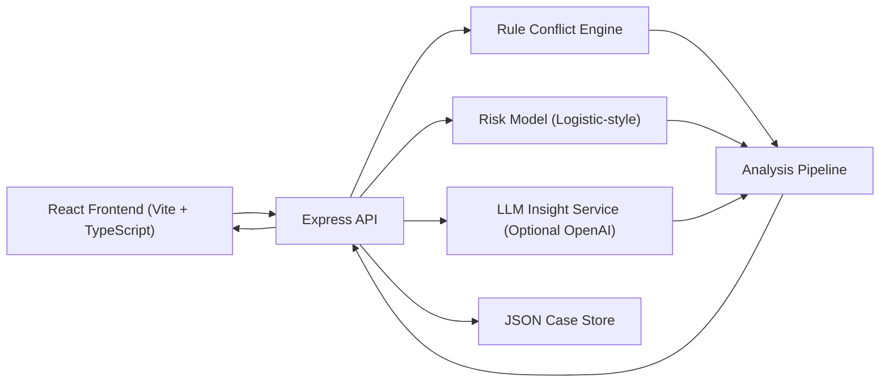

# SecondSight Pro

AI-assisted platform for patients and care coordinators to reconcile conflicting second medical opinions.

SecondSight Pro helps answer a hard question:
When two or more doctors disagree, is it expected medical complexity or a red flag that needs deeper specialist confirmation?

## 1) Product Scope

SecondSight Pro is a decision-support web application, not a diagnostic engine.

It provides:
- Structured capture of 2-5 doctor opinions
- Conflict analysis across diagnosis, treatment, prescriptions, tests, and urgency
- Hybrid scoring pipeline (rule engine + ML-inspired risk model)
- Optional LLM-generated plain-language insight with safe fallback
- Persistent case history and re-analysis workflow
- Specialist-ready summary output for follow-up consultations

## 2) Architecture



## 3) Repository Structure

```text
NW1/
├─ backend/
│  ├─ src/
│  │  ├─ config/
│  │  ├─ middleware/
│  │  ├─ routes/
│  │  ├─ services/
│  │  ├─ store/
│  │  ├─ types/
│  │  ├─ utils/
│  │  └─ server.ts
│  ├─ data/cases.json
│  ├─ .env.example
│  ├─ package.json
│  └─ tsconfig.json
├─ frontend/
│  ├─ src/
│  │  ├─ components/
│  │  ├─ constants/
│  │  ├─ services/
│  │  ├─ utils/
│  │  ├─ types.ts
│  │  ├─ App.tsx
│  │  └─ main.tsx
│  ├─ .env.example
│  └─ package.json
├─ TODO.md
├─ package.json
└─ README.md
```

## 4) Scoring Pipeline

### 4.1 Rule Conflict Engine
Computes alignment and disagreement on:
- Diagnosis similarity
- Treatment similarity
- Test/procedure similarity
- Medication consistency (same medicine, conflicting instructions)
- Urgency agreement (routine vs urgent vs emergency)

Produces:
- Rule conflict score (0-100)
- Risk tier: `low`, `moderate`, `high`
- Findings, recommended actions, specialist questions

### 4.2 ML-Inspired Risk Model
Uses weighted feature inputs from rule outputs:
- Diagnosis disagreement
- Treatment disagreement
- Medication disagreement
- Urgency disagreement
- Test disagreement
- Medication conflict count

Produces:
- Risk probability
- ML score (0-100)
- Feature contribution breakdown

### 4.3 Final Risk Score
Final score blends both engines:
- `finalScore = 0.7 * ruleScore + 0.3 * mlScore`

Final tier thresholds:
- `0-35`: Low
- `36-65`: Moderate
- `66-100`: High

### 4.4 LLM Insight Layer
If LLM is enabled and API key is configured:
- Generates executive summary
- Produces patient-friendly explanation
- Adds triage advice + consultation script

If LLM is unavailable:
- Automatic deterministic fallback summary is returned

## 5) API Contract

Base URL (default): `http://localhost:8080/api`

### Health
- `GET /health`

### Analysis
- `POST /analyze`

### Case Management
- `GET /cases`
- `POST /cases`
- `GET /cases/:id`
- `PUT /cases/:id`
- `POST /cases/:id/reanalyze`
- `DELETE /cases/:id`

### Reporting
- `GET /reports/:id/summary`

## 6) Local Setup

### Prerequisites
- Node.js `>=22`
- npm `>=11`

### Install
```bash
npm install
```

### Environment
Create env files from examples:
- `backend/.env.example`
- `frontend/.env.example`

Important backend envs:
- `PORT` (default `8080`)
- `FRONTEND_ORIGIN` (default `http://localhost:5173`)
- `ENABLE_LLM` (`true`/`false`)
- `OPENAI_API_KEY` (optional for live LLM)
- `OPENAI_MODEL` (default `gpt-4.1-mini`)
- `OPENAI_BASE_URL` (optional)

Frontend env:
- `VITE_API_BASE_URL` (default `http://localhost:8080/api`)

### Run (Dev)
```bash
npm run dev
```

This starts:
- Backend API on `http://localhost:8080`
- Frontend app on Vite default port `5173`

### Build
```bash
npm run build
```

### Lint
```bash
npm run lint
```

## 7) Example Analyze Payload

```json
{
  "caseData": {
    "caseLabel": "Thyroid conflict case",
    "primaryCondition": "Symptomatic thyroid nodule",
    "patientAge": 42,
    "comorbidities": ["Hypertension"],
    "symptoms": ["Neck pain"],
    "opinions": [
      {
        "doctorName": "Dr A",
        "specialty": "Endocrinology",
        "urgency": "soon",
        "diagnosis": "Benign nodule with hypothyroidism",
        "treatment": "Levothyroxine and follow-up",
        "prescriptions": ["Levothyroxine | 50 mcg daily"],
        "tests": ["TSH", "Ultrasound"]
      },
      {
        "doctorName": "Dr B",
        "specialty": "Oncosurgery",
        "urgency": "urgent",
        "diagnosis": "Suspicious malignancy",
        "treatment": "Repeat FNAC then surgery",
        "prescriptions": ["Levothyroxine | 25 mcg daily"],
        "tests": ["FNAC repeat", "CT neck"]
      }
    ]
  }
}
```

## 8) Quality Checks Completed

- TypeScript build passes (`backend` + `frontend`)
- Frontend lint passes
- Backend smoke test passes (`/health`, `/analyze`, `/cases`)
- End-to-end UI features implemented and wired

## 9) Safety, Clinical, and Legal Note

SecondSight Pro is **not** a medical diagnosis or prescription system.
It is a structured comparison and communication aid for patients and clinicians.
In case of emergency signs, users must follow immediate emergency medical care instructions.

## 10) Roadmap

- Authentication and encrypted-at-rest storage
- File upload + OCR for reports and prescriptions
- FHIR-compatible data exchange
- Audit logs and role-based access
- Clinician collaboration workspace
- Explainability panel with stronger evidence grounding
