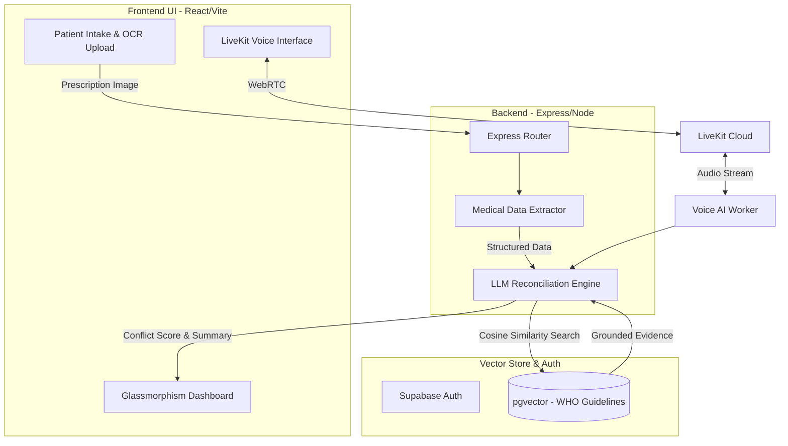

<div align="center">

# 🩺🎤 SecondSight Pro

**Intelligent Medical Second Opinion Reconciliation & RAG-Powered Voice Assistant**

*Built for Next-Gen Healthcare AI Hackathons*

[](#)
[](#)
[](#)
[](#)
[](#)
[](#)

*SecondSight Pro is a unified platform combining real-time voice interaction, medical OCR, LLM-based opinion conflict resolution, and evidence grounding via pgvector — all in a single, scalable deployment.*

</div>

<hr/>

## 🎯 The Vision & Problem Statement

Patients seeking a **Second Medical Opinion** face an impossible dilemma today: How do they navigate conflicting advice from two different specialists without possessing a medical degree?

* **The Paradox of Choice:** Doctor A suggests immediate surgery. Doctor B suggests 6 months of physiotherapy. The patient is left confused, anxious, and paralyzed.
* **Medical Hallucinations:** Using generic AI chatbots (like ChatGPT) for medical advice is extremely dangerous due to hallucinations and lack of evidence grounding.
* **Accessibility Barriers:** Complex medical jargon is hard to read. Patients often need someone to *explain* it to them simply, in their native language.

## 💡 Solution Overview

**SecondSight Pro** acts as an unbiased, intelligent mediator:
1. **Intakes Multiple Opinions:** Reads prescriptions via OCR and extracts Doctor A vs Doctor B's diagnoses.
2. **Generates a Conflict Score:** Objectively measures how different the two opinions actually are.
3. **Evidence Grounding (RAG):** Cross-references the conflict against **WHO Medical Guidelines** using Supabase `pgvector`.
4. **Voice-First Empathy:** Explains the situation to the patient over a real-time WebRTC Voice call (using LiveKit), answering follow-up questions in native languages.

---

## ⚔️ Why We Are Different (USP & Comparison)

| Feature / Platform | Generic LLMs (ChatGPT) | Traditional Telemed Apps | **SecondSight Pro** 🚀 |
| :--- | :---: | :---: | :---: |
| **Conflict Resolution** | ❌ Gets confused/agrees with prompt | ❌ Only connects to doctors | ✅ Explicitly reconciles opposing opinions |
| **Medical Evidence (RAG)** | ❌ Hallucinates treatments | ❌ Manual checking | ✅ Grounded in WHO Clinical Guidelines |
| **Real-time WebRTC Voice** | 🟡 Native app only | ✅ Doctor calls | ✅ Low-latency AI Voice Assistant |
| **Actionable Next Steps** | 🟡 Generic advice | ❌ Dependent on doctor | ✅ Generates "Questions to ask your specialist" |
| **Instant WhatsApp Share** | ❌ Copy-paste | 🟡 App-dependent | ✅ One-click deep-link WhatsApp sharing |

---

## ⚙️ System Architecture & Workflow



---

## ✨ Key Features

1. **LLM Opinion Reconciliation Engine** 🧠
   - Evaluates "Agreement vs Disagreement" computationally.
2. **Medical Voice Assistant (LiveKit WebRTC)** 🎙️
   - Interruptible, real-time voice interaction with the AI.
3. **RAG Evidence Grounding (pgvector)** 📚
   - Backed by real medical corpora (WHO Guidelines). Renders "Confidence Scores" dynamically.
4. **One-Click WhatsApp Share** 📱
   - Doctors/Patients can instantly share the "Executive Summary" directly via WhatsApp deep-links.
5. **Premium "Glassmorphism" UI** ✨
   - State-of-the-art React frontend with staggered Framer Motion micro-animations.

---

## 🛠 Tech Stack

| Component | Technology |
| :--- | :--- |
| **Frontend** | React, TypeScript, Vite, Framer Motion, CSS Modules |
| **Backend API** | Node.js, Express, TypeScript |
| **Primary AI Logic** | OpenAI GPT-4o, LangChain |
| **Voice Infrastructure** | LiveKit WebRTC, @livekit/components-react |
| **Voice STT/TTS** | Sarvam AI (Indic language fallback support) |
| **Vector DB / Auth** | Supabase (PostgreSQL + pgvector) |
| **Deployment** | Vercel (Frontend), Railway/Docker (Backend) |

---

## 🚀 Setup & Run Instructions

### 1. Database Setup (Supabase)
Run the provided SQL migration in your Supabase SQL Editor:
`backend/src/db/migrations/01_rag_setup.sql`

### 2. Backend Environment (`backend/.env`)
```env
OPENAI_API_KEY=sk-yourkey
NEXT_PUBLIC_SUPABASE_URL=https://your-project.supabase.co
SUPABASE_SERVICE_ROLE_KEY=your-service-key
LIVEKIT_API_KEY=your_key
LIVEKIT_API_SECRET=your_secret
```

### 3. Install & Start
```bash
# Clone the repository
git clone https://github.com/Niss54/Second-sight-pro.git
cd Second-sight-pro

# Install dependencies for both frontend and backend
npm run install-all

# Run the full stack concurrently
npm run dev
```

### 4. Ingest Medical Data (Optional)
To test the RAG engine locally:
```bash
cd backend
npm run ingest
```

<div align="center">
  <br/>
  <i>"5,000 conflicting opinions given every day. SecondSight Pro ensures patients are never lost in the confusion."</i>
</div>
