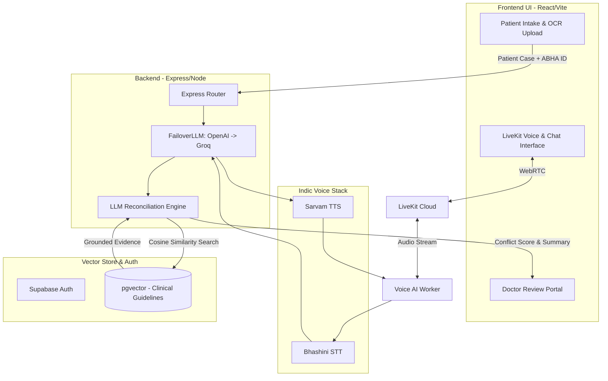

<div align="center">

# 🩺🎤 SecondSight Pro

**Intelligent Medical Second Opinion Reconciliation & RAG-Powered Voice Assistant**

*Built for Next-Gen Healthcare AI Hackathons*

[](#)
[](#)
[](#)
[](#)
[](#)
[](#)
[](#)
[](#)

*SecondSight Pro is a unified platform combining real-time voice interaction, medical OCR, LLM-based opinion conflict resolution, and evidence grounding via pgvector — all in a single, scalable deployment.*

</div>

<hr/>

## 🎯 The Vision & Problem Statement

Patients seeking a **Second Medical Opinion** face an impossible dilemma today: How do they navigate conflicting advice from two different specialists without possessing a medical degree?

* **The Paradox of Choice:** Doctor A suggests immediate surgery. Doctor B suggests 6 months of physiotherapy. The patient is left confused, anxious, and paralyzed.
* **Medical Hallucinations:** Using generic AI chatbots (like ChatGPT) for medical advice is extremely dangerous due to hallucinations and lack of evidence grounding.
* **Accessibility Barriers:** Complex medical jargon is hard to read. Patients often need someone to *explain* it to them simply, in their native language.

## 💡 Solution Overview

**SecondSight Pro** acts as an unbiased, intelligent mediator:
1. **Intakes Multiple Opinions:** Reads prescriptions via OCR and extracts Doctor A vs Doctor B's diagnoses.
2. **Generates a Conflict Score:** Objectively measures how different the two opinions actually are.
3. **Evidence Grounding (RAG):** Cross-references the conflict against **WHO and CDC Medical Guidelines** using Supabase `pgvector`.
4. **Voice-First Empathy:** Explains the situation to the patient over a real-time WebRTC Voice call (using LiveKit), answering follow-up questions in native languages (powered by **Bhashini STT** and **Sarvam TTS**).
5. **Doctor Portal:** Enables clinical review via an intelligent queue sorted by conflict severity.

---

## ⚔️ Why We Are Different (USP & Comparison)

| Feature / Platform | Generic LLMs (ChatGPT) | Traditional Telemed Apps | **SecondSight Pro** 🚀 |
| :--- | :---: | :---: | :---: |
| **Conflict Resolution** | ❌ Gets confused/agrees with prompt | ❌ Only connects to doctors | ✅ Explicitly reconciles opposing opinions |
| **Medical Evidence (RAG)** | ❌ Hallucinates treatments | ❌ Manual checking | ✅ Grounded in 5+ Clinical Guidelines |
| **Failover Architecture** | ❌ Fails if API goes down | ❌ NA | ✅ OpenAI → Groq zero-downtime fallback |
| **Native Indic Voice** | ❌ English focused | ❌ Human only | ✅ Bhashini STT + Sarvam AI TTS |
| **ABDM Ready** | ❌ NA | 🟡 Third party only | ✅ Native ABHA ID integration |

---

## ⚙️ System Architecture & Workflow



---

## ✨ Key Features (Hackathon Highlights)

1. **Indic Voice Assistant (Bhashini + Sarvam)** 🎙️
   - **Bhashini STT:** Real-time patient speech-to-text allowing Hindi/English input.
   - **Sarvam TTS:** High-fidelity, empathetic text-to-speech for medical explanations.
2. **FailoverLLM Architecture** 🛡️
   - Bulletproof demo infrastructure: Gracefully cascades from **OpenAI GPT-4o** to **Groq LLaMA-3.1** instantly if rate limits or network issues occur.
3. **Clinical Doctor Portal** 👨‍⚕️
   - A dedicated `/doctor` dashboard featuring a clinical review queue.
   - Automatically prioritizes cases based on an AI-calculated **Conflict Severity Score** (0-100%).
4. **Expanded RAG Evidence Grounding** 📚
   - Backed by expanded corpora including WHO Hypertension, CDC Diabetes, ACC AHA Heart Failure, and GOLD COPD guidelines.
5. **ABDM Integration Ready** 🇮🇳
   - Natively supports Ayushman Bharat Health Account (ABHA ID) linkage for interoperability.
6. **Premium "Glassmorphism" Patient Chat UI** ✨
   - Immersive full-page chat experience with dynamic animations and medical disclaimers.

---

## 🛠 Tech Stack

| Component | Technology |
| :--- | :--- |
| **Frontend** | React, TypeScript, Vite, Framer Motion, CSS Modules |
| **Backend API** | Node.js, Express, TypeScript |
| **Primary AI Logic** | OpenAI GPT-4o-mini |
| **Fallback AI Engine** | Groq (Llama-3.1-8b-instant) |
| **Voice Infrastructure** | LiveKit WebRTC, @livekit/components-react |
| **Voice STT/TTS** | Bhashini (Speech-to-Text), Sarvam AI (Text-to-Speech) |
| **Vector DB / Auth** | Supabase (PostgreSQL + pgvector) |

---

## 🚀 Setup & Run Instructions

### 1. Database Setup (Supabase)
Run the provided SQL migration in your Supabase SQL Editor:
`backend/src/db/migrations/01_rag_setup.sql`

### 2. Backend Environment (`backend/.env`)
Create a `.env` file based on `.env.example`:
```env
OPENAI_API_KEY=sk-yourkey
GROQ_API_KEY=gsk_yourkey
LIVEKIT_API_KEY=your_key
LIVEKIT_API_SECRET=your_secret
NEXT_PUBLIC_SUPABASE_URL=https://your-project.supabase.co
SUPABASE_SERVICE_ROLE_KEY=your-service-key
```

### 3. Install & Start
```bash
# Clone the repository
git clone https://github.com/Niss54/Second-sight-pro.git
cd Second-sight-pro

# Install dependencies for both frontend and backend
npm run install-all

# Run the full stack concurrently
npm run dev
```

### 4. Ingest Medical Data (Optional)
To test the expanded RAG engine locally:
```bash
cd backend
npm run ingest
```

<div align="center">
  <br/>
  <i>"5,000 conflicting opinions given every day. SecondSight Pro ensures patients are never lost in the confusion."</i>
</div>
