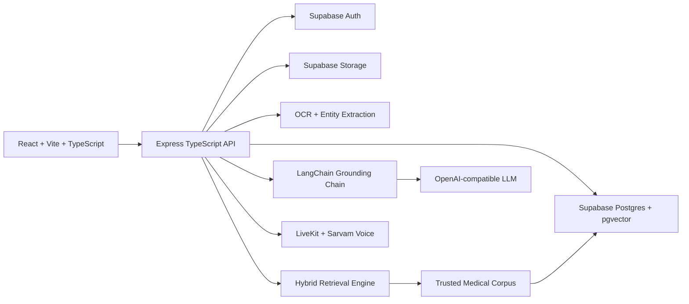
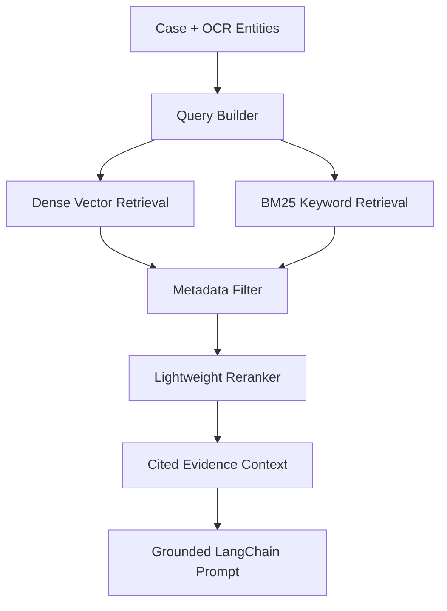
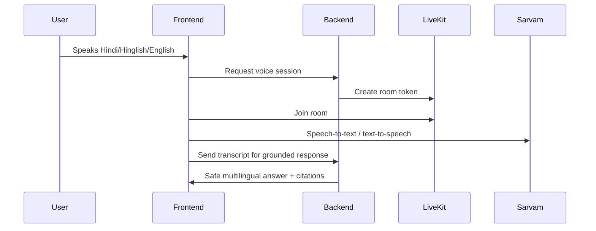

# SecondSight Pro Architecture

SecondSight Pro is an evidence-grounded AI Medical Opinion Reconciliation Platform. It helps patients understand conflicting medical opinions without diagnosing, prescribing, or replacing licensed medical care.

## Target System

## Request Flow

1. User uploads reports or enters doctor opinions.
2. OCR extracts text and medical entities from PDF/image files.
3. Existing conflict engine compares diagnoses, treatments, medications, tests, and urgency.
4. Hybrid RAG retrieves trusted evidence from the pre-indexed corpus.
5. LangChain injects evidence into a strict safety prompt.
6. API returns grounded findings, citations, explainability, multilingual summaries, and specialist questions.
7. Frontend renders the dashboard, report, and voice assistant.

## RAG Pipeline

## Voice Flow

## Safety Boundary

The system is decision support only. All clinical explanations must be evidence-grounded, cite sources, and avoid diagnosis, prescription, or overriding clinician advice.
